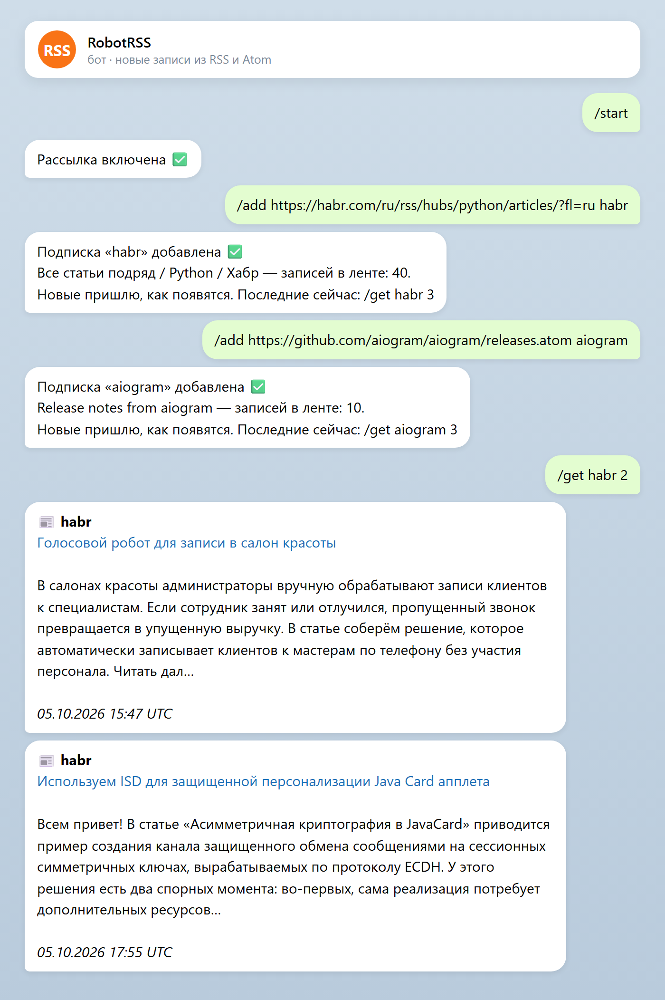
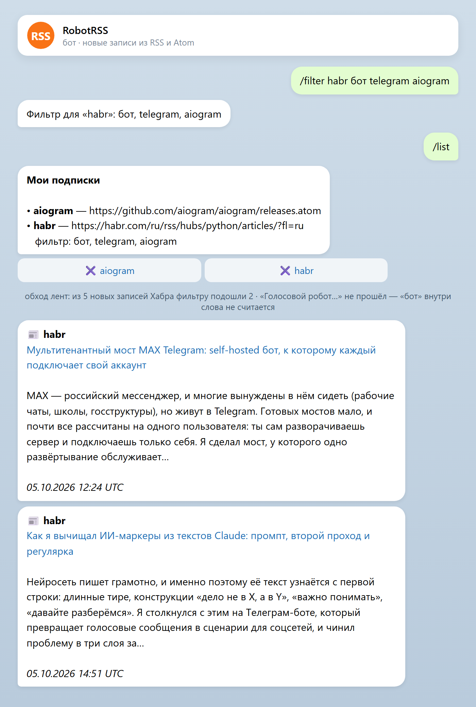
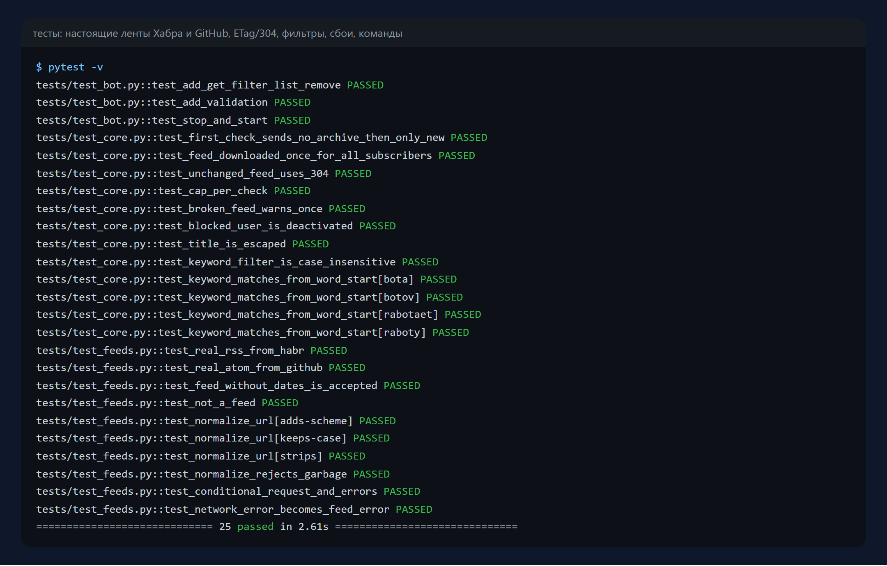

# RobotRSS 2 — RSS-бот для Telegram


Бот присылает в Telegram новые записи из RSS и Atom лент: новости, блоги,
релизы на GitHub, вакансии, объявления. Можно подписаться на несколько лент,
настроить фильтр по словам и запросить последние записи вручную.

> Это возрождение заброшенного проекта
> [cbrgm/telegram-robot-rss](https://github.com/cbrgm/telegram-robot-rss)
> (191★, в архиве с 2021 года). Оригинал был написан на Python 2.7 и
> python-telegram-bot 8.1 образца 2017 года и на современном Python не
> запускается. Код переписан, команды и идея сохранены, лицензия — та же MPL-2.0.

Python 3.11+ · aiogram 3 · httpx · feedparser · SQLite · pytest · Docker

| Подписка и последние записи | Фильтр и новые записи |
|---|---|
|  |  |

Скриншоты — из прогона на настоящих лентах Хабра и GitHub.

## Команды

```
/add <адрес> <название>     подписаться на ленту
/filter <название> <слова>  присылать только записи с этими словами (/filter <название> - — снять)
/get <название> [1–10]      последние записи прямо сейчас
/list                       подписки, с кнопками удаления
/remove <название>          отписаться
/stop, /start               поставить рассылку на паузу и включить
```

## Что изменено по сравнению с оригиналом

**Переписано под современный стек**
- Python 2.7 → 3.11+, python-telegram-bot 8.1 → aiogram 3, потоки → asyncio,
  feedparser 5 → 6, загрузка лент через httpx;
- из репозитория убрана закоммиченная папка виртуального окружения,
  конфиг-файл с токеном заменён переменными окружения, Dockerfile обновлён.

**Исправлены ошибки оригинала**
- лента скачивалась заново для каждого подписчика — теперь один раз на всех;
- новые записи определялись по датам, а ленты без поля `updated` отвергались
  целиком — теперь запоминаются уже отправленные записи по их id, даты не нужны;
- при сбое ленты бот каждые 5 минут слал всем одно и то же сообщение об
  ошибке — теперь предупреждает один раз, после нескольких сбоев подряд;
- заголовки не экранировались: символ `<` или `&` в заголовке ломал отправку;
- адрес ленты целиком переводился в нижний регистр, ломая адреса с
  регистрозависимым путём;
- пользователь, заблокировавший бота, больше не получает попыток отправки.

**Добавлено**
- фильтр по словам для каждой подписки — с начала слова, чтобы «бот» находил
  «бота» и «ботов», но не «работает»;
- условные запросы (ETag / Last-Modified): если лента не менялась, сервер
  отвечает 304 и ничего не скачивается;
- при подписке архив ленты не присылается — только то, что появится дальше;
- не больше N новых записей за обход (защита от наводнения после простоя);
- кнопки удаления в `/list`, пауза рассылки без потери подписок.

## Запуск

```bash
pip install -r requirements.txt
BOT_TOKEN=123:abc python -m robotrss
```

Или в Docker:

```bash
docker build -t robotrss .
docker run -d -e BOT_TOKEN=123:abc -v robotrss-data:/data robotrss
```

Настройки — переменные окружения: `BOT_TOKEN`, `DB_PATH`, `CHECK_INTERVAL`
(секунд между обходами, по умолчанию 300), `MAX_PER_CHECK`, `FAILS_BEFORE_NOTICE`.

## Тесты

```bash
pytest -v
```

Разбор настоящих лент Хабра (RSS) и GitHub (Atom), лента без дат, ETag/304,
обход с несколькими подписчиками и фильтрами, ограничение числа записей,
предупреждение о сбое один раз, экранирование, команды бота — 25 тестов,
без обращения к сети и к Telegram.



## Лицензия

[Mozilla Public License 2.0](LICENSE.md), как у оригинала. Автор оригинального
проекта — [cbrgm](https://github.com/cbrgm).
